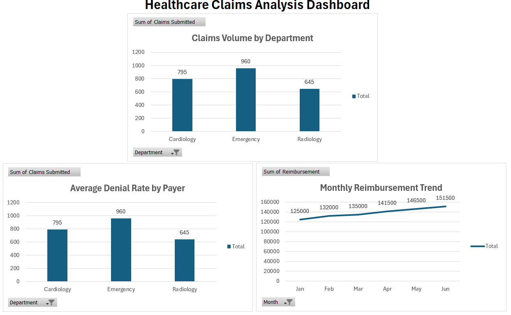

# Healthcare Claims Analysis

## Overview
This project analyzes healthcare claims performance across payers, departments, and claim types to identify denial trends, reimbursement patterns, and operational insights.

---

## Problem Statement
Healthcare organizations need better visibility into claims performance to reduce denial rates, improve reimbursement outcomes, and support efficient revenue cycle operations.

---

## Tools & Technologies
- Excel  
- Data Analysis  
- Healthcare Claims Analytics  

---

## Methodology
- Structured claims dataset across payers, departments, and claim types  
- Calculated denial rates to evaluate claim performance  
- Analyzed claims volume by department  
- Evaluated reimbursement trends across months  

---

## Key Insights
- Emergency department had the highest claims volume  
- Denial rates varied across payers, indicating optimization opportunities  
- Reimbursement showed consistent growth over time  

---

## Dashboard

---

## Business Impact
- Helps reduce claim denials through data insights  
- Improves reimbursement tracking and financial performance  
- Supports better revenue cycle decision-making  

---

## Author
Vinay Kumar Thota
